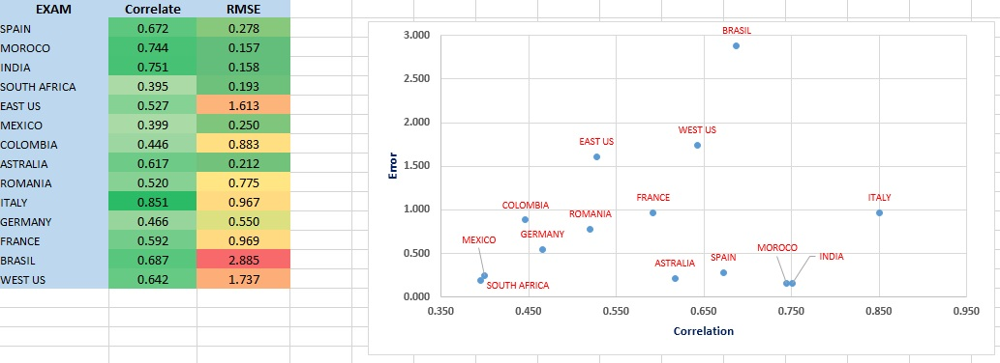
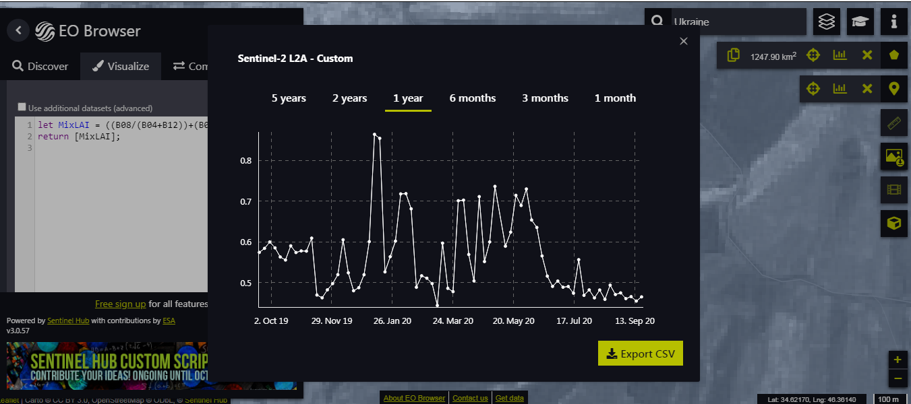
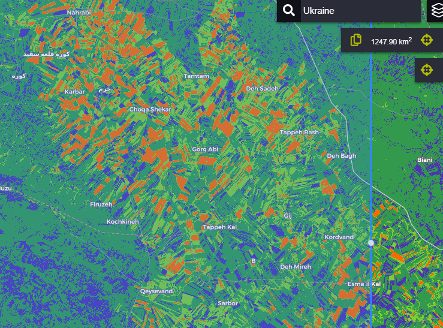

# Mix Leaf Area Index (MixLAI)

## Intrudoction

Globally, improving remotely sensed characterization of biophysical properties of vegetation is of paramount importance for a variety of applications. Changes of Plant Leaf Area and Its Relationships with Soil Factors in the Process of Grassland Desertification.In particular, the non-destructive estimation of the Leaf Area Index (LAI) from earth observation data has been topical for decades. LAI is defined as the one-sided green leaf area per unit ground area.
This script represents the leaf area index using the Sentinel 2 satellite. There are examples of this equation, but this equation uses the value of several different bands to calculate the leaf index value in a simple way.
Leaf area index is one of the most important parameters in determining plant yields.
On the other hand, agricultural scientists calculate this index using special hardware. But because of the global reach of the index in this method, the basis of validation is the data of MODIS product : MCD15A3H(500 M, 4 DAY).
The present script is the result of combining and simplifying the previous methods.

But the initial idea of ​​the script was based on the following basic method:

Lymburner, L., Beggs, P.J., Jacobson, C.R., 2000. Estimation of canopy-average surface-specific leaf area using Landsat TM data. Photogramm. Eng. Remote Sens. 66, 183–191.

## Validate

Leaf area index is one of the most important parameters in determining plant yields. On the other hand, agricultural scientists calculate this index using special hardware. But because of the global reach of the index in this method, the basis of validation is the data of MODIS product: MCD15A3H(500 M, 4 DAY).

 Random data analysis has been selected from all over the world. Product data is obtained from the following address:
https://lpdaacsvc.cr.usgs.gov/appeears/explore.

Pearson correlation and mean error methods were used to check the validity of the data. The average error is obtained with this method:

MAE = (ABS(MODIS - S2)/C); MAE:  mean absolute error; C: count image (Picture of the same day) in the year: Sep 2019-Sep2020.

exam point of world:

long	lat

-3.787585	40.089773

-4.991665	33.647475

75.28038	24.862526

24.106951	-31.276369

-82.253509	34.582171

-101.92016	22.943836

-73.503856	3.385921

149.130662	-30.375819

22.50151	45.943571

11.464104	43.512098

11.664784	51.26062

1.229418  44.669143

-122.048149	44.590588

-67.949633	-5.25761

## Exam Result

## Export Chart

## Export Image

## Function

MixLAI = ((B08/(B04+B11))+(B08/(B04+B12)))/2.0

## EO Browser View Code
<"EO Browser Link">
